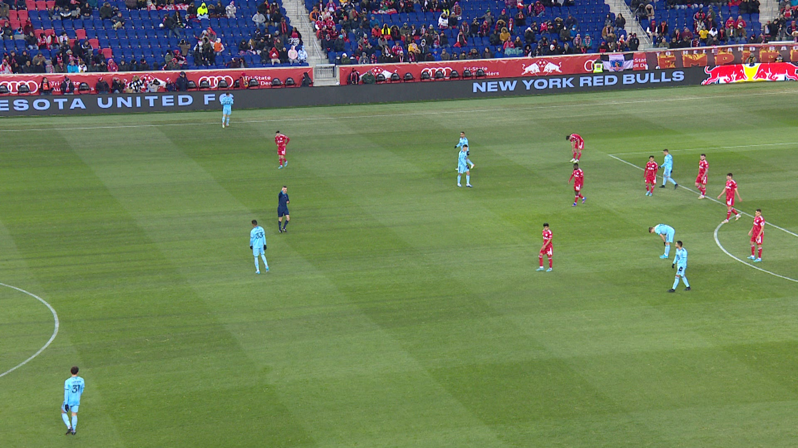
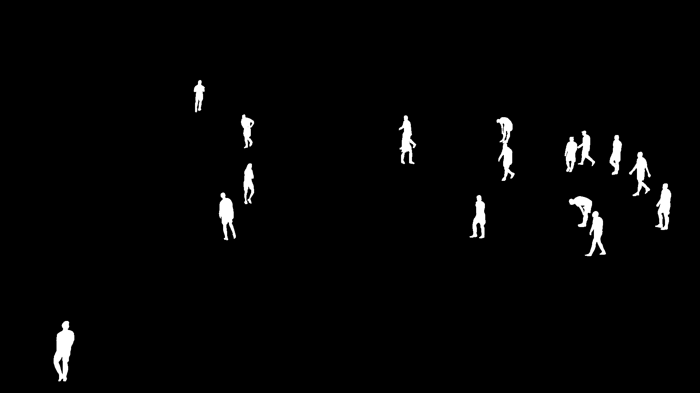

# PlayerSegmentationUNet

## Описание

**PlayerSegmentationUNet** — это проект по семантической сегментации изображений с использованием архитектуры **U-Net** на PyTorch. Модель обучается на наборе изображений с масками игроков, распознаёт и выделяет игроков на изображениях.

Проект включает в себя:
- реализацию архитектуры U-Net,
- загрузку и предобработку датасета,
- обучение модели с использованием функции потерь Dice и BCEWithLogits,
- сохранение весов модели,
- визуализацию результата сегментации.

---

## Структура проекта

```
PlayerSegmentationUNet/
├── dataset_seg/
│   ├── images/         # Папка с изображениями
│   └── masks/          # Папка с бинарными масками
├── model_unet_seg.tar  # Сохранённые веса модели после обучения
└── PlayerSegmentationUNet.py             # Основной скрипт обучения и предсказания
└── requirements.txt    # Зависимости
```

---

## Требования

- Python 3.8+
- PyTorch
- torchvision
- tqdm
- matplotlib
- PIL (Pillow)
- numpy

---

## Использование

### 1. Подготовка данных

Разместите изображения и соответствующие маски в папке `dataset_seg`:
- `dataset_seg/images/` — цветные изображения;
- `dataset_seg/masks/` — бинарные маски (игроки = белый цвет (255), фон = чёрный (0)).

Имена файлов изображений и масок должны совпадать.

### 2. Обучение модели

Запустите скрипт `PlayerSegmentationUNet.py`, чтобы начать обучение модели:

```bash
python PlayerSegmentationUNet.py
```

Параметры обучения:
- Размер входного изображения: **256x256**
- Эпохи: **100**
- Batch size: **16**
- Оптимизатор: **RMSprop**
- Функции потерь: **BCEWithLogits + SoftDiceLoss**

По завершении модель будет сохранена в файл `model_unet_seg.tar`.

### 3. Предсказание и визуализация

После обучения модель делает предсказание на одном изображении (`dataset_seg/images/0.jpg`) и визуализирует предсказанную маску с порогом 0.1.

---

## Архитектура модели

Модель построена на основе классической U-Net:

- 4 блока энкодера (с downsampling),
- bottleneck слой (1024 каналов),
- 4 блока декодера (с upsampling и skip-связями),
- выходной слой с 1 каналом (сигмоида применяется в процессе предсказания).

---

## Функция потерь

Проект использует комбинацию двух функций потерь:

- `BCEWithLogitsLoss` — бинарная кросс-энтропия с логитами;
- `SoftDiceLoss` — модифицированная Dice Loss, сглаженная и дифференцируемая.

---

## Пример результата

После обучения:

- Оригинальное изображение:



- Ожидаемая маска:



